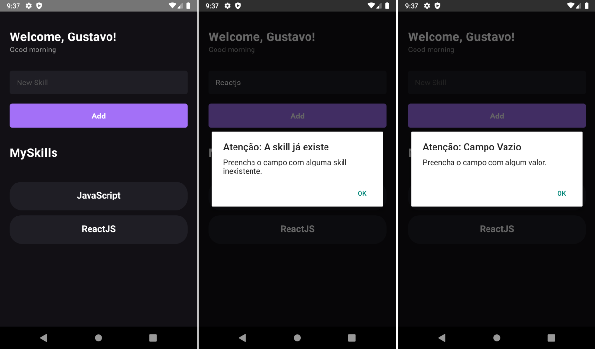

# MySkills

## Detalhes da aplicação:

Reprodução de um aplicativo construído no Chapter 1 do curso Ignite (Trilha de React Native), feito pela Rockeseat.

- Ao digitar no input de texto e pressionar o botão "Add" é adicionado uma habilidade nova na lista.
- Ao clicar em uma habilidade você remove ela da lista.
- Caso existam espaços adicionais no input de texto ao pressionar o botão "Add", o aplicativo irá limpar esses espaços adicionais.
- No app, há validações no input de texto para impedir que o usuário adicione uma habilidade que já existe ou adicione uma string vazia.
- O aplicativo pega a hora atual do aparelho e dependendo dessa hora ele renderiza "Good morning", "Good afternoon", "Good night".

## Imagens:



## Comandos

Instalação das dependências:

```bash
# install dependencies
yarn
```

Conectar ao emulador:

```bash
# connect to emulator
adb devices
```

Executar a aplicação no emulador Android:

```bash
# run app
yarn android
```

## Bibliotecas usadas na aplicação:

[comment]: # "Use ✅ para positivo e ❌ para negativo"

&#9989; Typescript

## Hooks do React usados na aplicação:

[comment]: # "Use ✅ para positivo e ❌ para negativo"

&#9989; useState\
&#9989; useEffect

## Core Components usados na aplicação:

[comment]: # "Use ✅ para positivo e ❌ para negativo"

&#9989; Stylesheet\
&#9989; SafeAreaView\
&#9989; StatusBar\
&#9989; TouchableOpacity\
&#9989; Text\
&#9989; TextInput\
&#9989; View\
&#9989; Alert
